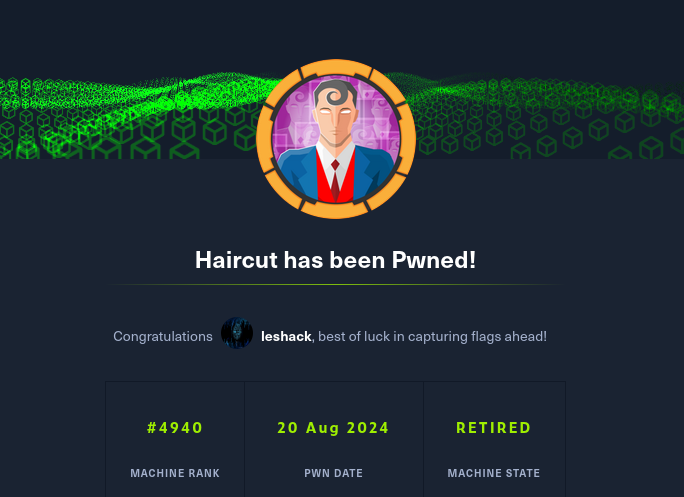

# Hackthebox

Hands on servers successful pwned machines:
# Lame

# Legacy

# DEVEL 

# POPCORN

# BEEP

# OPTIMUM

# BASTARD

# Tenten

# ARCTIC

# CRONOS

# GRANDPA

# GRANNY

# OCTOBER

# BRAINFUCK

# LAZY

# SNEAKY

# JOKER

# HAIRCUT

# HOLIDAY

# BANK

# EUROPA

# CALAMITY

